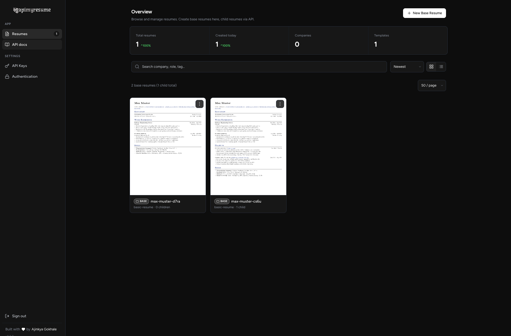

# APIMyResume — Open-Source Resume API & PDF Generator

**Turn one profile into a tailored, professional PDF resume for every job — automatically.**

APIMyResume is a free, self-hosted, open-source **resume builder API**. You keep **one** master
resume, and the API creates a fresh, job-specific **PDF resume** for each application. Hook up
an AI agent, [n8n](https://n8n.io), or [Zapier](https://zapier.com) and let it tailor your
resume to any job description in seconds.

Great for job seekers, developers automating their job hunt, and anyone building AI resume
tools who wants clean, ATS-friendly PDF resumes without endless copy-pasting.



## Why APIMyResume?

- **One profile, unlimited resumes** — write your experience once, generate a tailored
  version for every job.
- **Built for AI & automation** — a simple REST API with API-key auth that works with
  ChatGPT/Claude agents, n8n, and Zapier.
- **Beautiful PDFs** — pixel-perfect resumes rendered with [Typst](https://typst.app).
- **ATS-friendly** — inject the right keywords per job so you pass automated resume
  screeners.
- **Dashboard included** — manage resumes, preview PDFs, and create API keys in your
  browser.
- **Self-host in one command** — a single Docker image with SQLite built in. No external
  services needed.

## Quick start

Run it with Docker:

```bash
docker compose up -d
```

The app (API + dashboard) is now at **http://localhost:3000**.

Grab your API key (created automatically on first run):

```bash
docker compose logs api | grep "API key"
```

Open http://localhost:3000, create your base resume, and start generating tailored PDFs.

👉 Full instructions, custom domains, and HTTPS: **[Self-Hosting Guide](docs/SELF-HOSTING.md)**.

## How it works

1. You create **one base resume** — your full profile. This is your source of truth.
2. For each job, the API makes a **child resume** — a copy of the base with small tweaks
   (new keywords, reworded bullets) for that specific role.
3. Each child is rendered to its own **PDF**, ready to send.

Your base resume never changes by accident — automation only ever edits the job-specific copies.

## Documentation

- 📘 **[API Reference](docs/API.md)** — how to create and update tailored resumes with the API
  (perfect for AI agents, n8n, and Zapier).
- 🚀 **[Self-Hosting Guide](docs/SELF-HOSTING.md)** — Docker, custom domain + HTTPS,
  configuration, security, and local development.

## License

Released under the [MIT License](LICENSE.md) — do whatever you want :D
